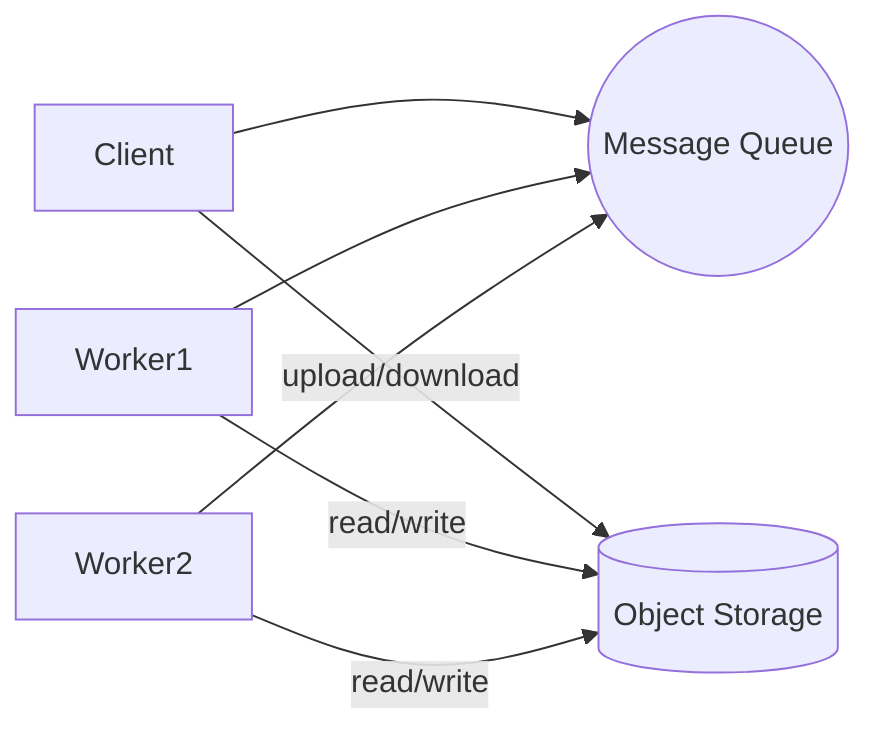
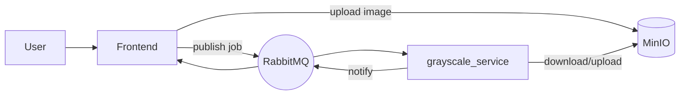

# OpenMP Image Processing

This project demonstrates how a small OpenMP kernel can evolve from a single
program into a set of microservices connected through a message queue.  The
repository documents each step of this journey from **monolithic** code to a
minimal **event-driven** architecture.

## Repository layout

```text
monolithic/     – single process version with benchmarks
microservices/  – HTTP service exposing the algorithm
event-driven/   – RabbitMQ + MinIO stack with frontend and worker
old/            – historic experiments kept for reference
images/         – sample pictures used in the examples
```

Each folder contains a README with more details. Below is a quick summary of how
to launch every stage.

### Running the monolithic program

```bash
cd monolithic
python3 -m venv .venv
source .venv/bin/activate
pip install -r requirements.txt
./scripts/bench_and_plot_monolithic.sh images/test.jpg "1 2 4 6" 1 1
```

### Running the microservice

```bash
cd microservices/grayscale
docker build -t grayscale-service .
docker run --rm -p 5000:5000 grayscale-service
```

Send a POST request to `http://localhost:5000/grayscale` (see
`microservices/README.md` for a helper client).

### Running the event-driven stack

```bash
cd event-driven
docker compose up --build
```

Open <http://localhost:8080> and upload an image. The frontend publishes a job
on RabbitMQ and the worker stores the processed result in MinIO.

## Architecture transition

The repository illustrates how the original single binary evolves into a
decoupled system. The diagrams below summarise the three stages.

### Monolithic


### Generic event-driven microservices



### This repository (event-driven folder)



## Microservices

A new directory `microservices/` shows how the processing algorithms can be exposed as standalone services. The first available service is `grayscale`, which wraps the OpenMP grayscale conversion inside a small Flask application and Docker container. See `microservices/README.md` for details on building and running the container and for a small client helper script to test it.

The microservice directory also contains a script to benchmark the service using different thread counts:
```bash
./microservices/grayscale/scripts/bench_grayscale_service.sh images/test.jpg "1 2 4 6" 2 1000
```
See `microservices/README.md` for details.

## Running on Windows with WSL

The easiest way to run the project on Windows is through the
[Windows Subsystem for Linux](https://learn.microsoft.com/windows/wsl/).
The following steps assume an Ubuntu distribution but any recent Linux
will work.

1. **Install WSL**
   - Open PowerShell as administrator and run:

     ```powershell
     wsl --install -d Ubuntu
     ```

   - Restart the system if prompted and complete the Ubuntu setup.

2. **Install dependencies inside WSL**

   ```bash
   sudo apt update
   sudo apt install build-essential git python3 python3-pip time \
        python3-matplotlib python3-pandas
   ```

3. **Clone this repository (still inside WSL)**

   ```bash
   git clone <repo-url>
   cd OpenMp-Parallel-Computing
   ```

4. **Run the benchmark script**

   ```bash
   cd monolithic/scripts
   ./bench_and_plot_monolithic.sh ../images/test.jpg
   ```

Results and graphs will be available under `monolithic/results/`.

### Verify Physical CPU and Virtual CPU
  
  ```bash
  lscpu | grep -E '^CPU|^Core|^Socket'
  ```